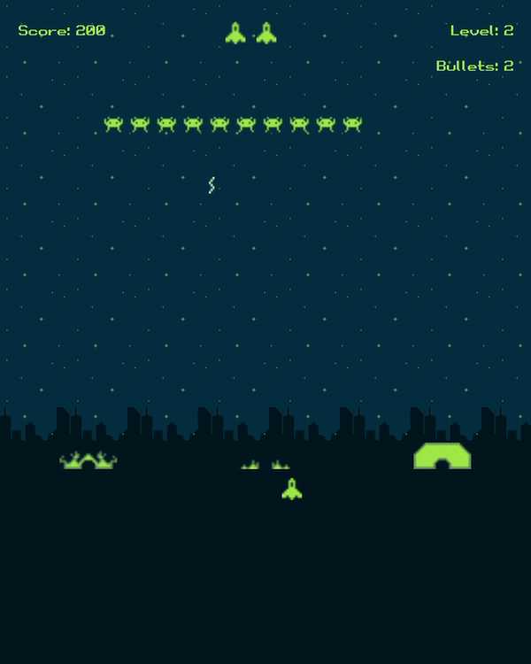

# Space Invaders
Implementation of the classic arcade game of SpaceInvaders.

This version is implemented using the Processing, a flexible software sketchbook and a language for learning how to code within the context of the visual arts. To learn more, see https://processing.org/.

# Gameplay
Here's the gameplay:

# How To Play
1) Install Processing from https://processing.org/
2) Clone this repo
3) Open file `SpaceInvaders.pyde` and press `Ctrl+R`.
4) Enjoy!
